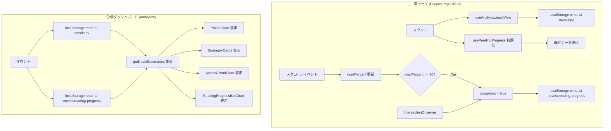

# 内部設計書 — 読者分析ダッシュボード

## API / DB 設計

**N/A（SSG + localStorage のみ）**

本機能はサーバーサイド API・データベースを持たない。全データは閲覧端末の `localStorage` に保存され、Next.js の静的サイト生成（SSG）と組み合わせてクライアントサイドのみで動作する。

---

## localStorage データスキーマ

### キー: `ai-novels:pv`

PV（ページビュー）トラッキングデータ。

```typescript
type PVStore = {
  [novelSlug: string]: {
    [chapterNumber: string]: {
      views: number;       // 訪問回数
      lastViewed: string;  // ISO 8601 形式 (例: "2026-03-27T10:00:00.000Z")
    };
  };
};
```

**例:**
```json
{
  "stellar-drift": {
    "1": { "views": 5, "lastViewed": "2026-03-27T10:00:00.000Z" },
    "2": { "views": 2, "lastViewed": "2026-03-26T22:30:00.000Z" }
  }
}
```

---

### キー: `ai-novels:reading-progress`

読了率トラッキングデータ。

```typescript
type ReadingProgressStore = {
  [novelSlug: string]: {
    [chapterNumber: string]: {
      readPercent: number;   // 0–100（スクロール到達率）
      completed: boolean;    // true = 章末尾到達
    };
  };
};
```

**例:**
```json
{
  "stellar-drift": {
    "1": { "readPercent": 100, "completed": true },
    "2": { "readPercent": 47, "completed": false }
  }
}
```

---

## TypeScript 型定義

```typescript
// --- PV ---
export interface ChapterPV {
  views: number;
  lastViewed: string;
}
export type NovelPVMap = Record<string, ChapterPV>;   // key: chapterNumber(string)
export type PVStore = Record<string, NovelPVMap>;      // key: novelSlug

// --- Reading Progress ---
export interface ChapterReadingProgress {
  readPercent: number;
  completed: boolean;
}
export type NovelProgressMap = Record<string, ChapterReadingProgress>;
export type ReadingProgressStore = Record<string, NovelProgressMap>;

// --- Analytics Summary (ダッシュボード用集計結果) ---
export interface NovelAnalyticsSummary {
  novelSlug: string;
  novelTitle: string;
  totalViews: number;
  completedChapters: number;
  totalChapters: number;
  completionRate: number;       // 0–100
  lastViewedAt: string | null;  // ISO 8601 or null
}

export interface ChapterAnalyticsDetail {
  novelSlug: string;
  chapterNumber: number;
  chapterTitle: string;
  views: number;
  readPercent: number;
  completed: boolean;
  lastViewed: string | null;
}
```

---

## Custom Hooks 設計

### `useAnalytics(novelSlug: string, chapterNumber: number)`

**責務:**
- 章ページ訪問時に PV をインクリメント（マウント時に1回）
- localStorage からダッシュボード集計データを提供

```typescript
// hooks/useAnalytics.ts
export function useAnalytics(novelSlug: string, chapterNumber: number): {
  pvData: PVStore;
  trackView: () => void;
  getNovelSummaries: () => NovelAnalyticsSummary[];
  getChapterDetails: (slug: string) => ChapterAnalyticsDetail[];
}
```

**処理フロー（trackView）:**
1. `localStorage.getItem('ai-novels:pv')` を JSON パース（取得失敗時は空オブジェクト）
2. `store[novelSlug][chapterNumber].views` をインクリメント
3. `lastViewed` を現在時刻（ISO 8601）で更新
4. `localStorage.setItem('ai-novels:pv', JSON.stringify(store))` で永続化
5. エラー時（localStorage 容量超過等）はサイレントに無視（ユーザー操作をブロックしない）

**getNovelSummaries 集計ロジック:**
- 全 novel を `getAllNovels()` で取得
- 各 novel について PVStore・ReadingProgressStore から集計
- `totalViews`: 全章の views 合計
- `completedChapters`: `completed === true` の章数
- `completionRate`: `completedChapters / totalChapters * 100`（小数点以下切り捨て）
- `lastViewedAt`: 全章の `lastViewed` の最大値（最新）

---

### `useReadingProgress(novelSlug: string, chapterNumber: number)`

**責務:**
- IntersectionObserver で章末尾要素の到達を検知
- スクロール率と読了フラグを localStorage に永続化

```typescript
// hooks/useReadingProgress.ts
export function useReadingProgress(novelSlug: string, chapterNumber: number): {
  readPercent: number;
  completed: boolean;
  endRef: React.RefObject<HTMLDivElement>;  // 章末尾要素に付与する ref
}
```

**処理フロー:**
1. `useScrollPercent()` フック（`ReadingProgressBar` と共用）から `scrollPercent` を受け取る（DR-G2-m02: 重複実装解消）
2. `scrollPercent` が 90 以上、または `endRef` 要素が viewport 内に入った場合 `completed = true`
3. 状態変化時に `localStorage` へ書き込み（デバウンス: 500ms）
4. マウント時に `localStorage` から既存データを読み込み初期値として設定

> **`useScrollPercent` の責務（新規フック）:** `window.scroll` イベントを購読し `scrollPercent: number`（0–100）を返す。`ReadingProgressBar` も同フックを使用するよう合わせてリファクタリングする。

**IntersectionObserver 設定:**
```typescript
const observer = new IntersectionObserver(
  (entries) => {
    if (entries[0].isIntersecting) setCompleted(true);
  },
  { threshold: 0.5 }
);
```

---

## スコープ外機能（今回対象外）

以下は設計段階のレビュー（DR-G2-M01 / DR-G2-M02）でスコープ外と確定した機能。

| 機能 | 判定 | 理由 |
|---|---|---|
| お気に入り数カード | **除外** | localStorage にお気に入りデータが存在しない。`NovelAnalyticsSummary` に `favorites` フィールドは持たない |
| 前週比バッジ（▲▼） | **除外** | 日別 PV 集計ロジックと追加 localStorage フィールドが必要。今回の要件に含まれない |
| 期間セレクター（7日/30日/90日） | **除外** | 日別集計ロジックが未設計。`lastViewed` フィールドで実現可能だが FR に未記載のため今回はスコープ外 |

---

## コンポーネント構成

```
app/
└── analytics/
    └── page.tsx                        # SSG ページ（metadata 定義 → AnalyticsDashboardClient へ委譲）
        └── AnalyticsDashboardClient.tsx  # 'use client' / ダッシュボード本体

components/
└── analytics/
    ├── SummaryCards.tsx                # 概要カード × 2（総PV / 平均読了率）
    ├── AccessTrendChart.tsx            # 折れ線グラフ SVG（日別アクセス推移・全幅）
    ├── PVBarChart.tsx                  # 縦棒グラフ SVG（作品別 PV ランキング・左半幅）
    ├── ReadingProgressBarChart.tsx     # 横棒グラフ SVG（章別読了率・右半幅）
    └── EmptyState.tsx                  # データなし表示（localStorage にデータ未存在時）

lib/
└── hooks/
    ├── useAnalytics.ts                 # PV トラッキング & 集計
    ├── useReadingProgress.ts           # 読了率トラッキング
    └── useScrollPercent.ts             # スクロール率算出ロジック（ReadingProgressBar と共用）— DR-G2-m02

```

### 画面仕様書コンポーネント対応表（DR-G2-M04）

| SCR-001 コンポーネント（画面仕様書） | 実装コンポーネント（内部設計） |
|---|---|
| 概要カード × 2（総PV / 平均読了率） | `SummaryCards.tsx` |
| アクセス推移グラフ（折れ線 SVG） | `AccessTrendChart.tsx` |
| PVランキング（縦棒 SVG） | `PVBarChart.tsx` |
| 読了率チャート（横棒 SVG） | `ReadingProgressBarChart.tsx` |
| データなし表示 | `EmptyState.tsx` |

### 既存コンポーネントへの変更

| コンポーネント | 変更内容 |
|---|---|
| `ChapterPageClient.tsx` | `useAnalytics` と `useReadingProgress` を呼び出し追加 |
| `ChapterNavigation.tsx` | `nextChapter?: { title, previewText }` を props に追加。既存の `nextTitle?: string` は `nextChapter.title` に一本化するため削除。冒頭テキストは最大 80 文字 |

#### ChapterNavigation 改善後 Props

```typescript
interface ChapterNavigationProps {
  novelSlug: string;
  currentChapter: number;
  totalChapters: number;
  prevTitle?: string;
  nextTitle?: string;
  // 追加
  nextChapter?: {
    title: string;
    previewText: string;  // content 先頭 80 文字（最大）— DR-G2-C03 統一値
  } | null;
}
```

---

## データフロー図



---

## エラーハンドリング

| エラー種別 | 発生条件 | 処理 |
|---|---|---|
| localStorage 読み取り失敗 | ブラウザのプライベートモード等 | try-catch でキャッチし空データとして扱う。トラッキング停止（画面は正常表示） |
| localStorage 書き込み失敗 | 容量超過（QuotaExceededError） | サイレントに無視。ユーザー操作をブロックしない |
| JSON パース失敗 | localStorage が壊れている場合 | 空オブジェクトで初期化し上書き |
| SSR 環境での window アクセス | Next.js SSR 実行時 | `typeof window === 'undefined'` チェックで早期 return |

---

## パフォーマンス設計

| 項目 | 目標値 | 対策 |
|---|---|---|
| localStorage 書き込み | 500ms デバウンス | 高頻度スクロールでの書き込み抑制 |
| ダッシュボード初期表示 | < 100ms | localStorage は同期 API。全データは端末内。外部通信なし |
| IntersectionObserver | — | `disconnect()` でアンマウント時に解除（メモリリーク防止） |
| localStorage サイズ | 目標 < 100KB | 小説3作・全章分でも PV + 進捗データは数KB 程度。問題なし |

---

## セキュリティ設計

**入力値サニタイズ方針:**
- localStorage から読み込んだデータは必ず TypeScript 型ガードまたは `zod` でバリデーション後に使用する
- `novelSlug`・`chapterNumber` は URL パラメータ由来のため、`localStorage` キー構築前に英数字・ハイフン・数字のみ許可するパターンで検証する（オブジェクトキーインジェクション防止）
- ダッシュボードで表示する文字列（小説タイトル・章タイトル）は静的 JSON 由来であり、HTML インジェクションは不要。ただし将来的にユーザー入力を含む場合は `textContent` 経由で表示すること

```typescript
// キー検証例
function isSafeSlug(slug: string): boolean {
  return /^[a-z0-9-]+$/.test(slug);
}
function isSafeChapterNumber(n: number): boolean {
  return Number.isInteger(n) && n > 0 && n < 10000;
}
```
